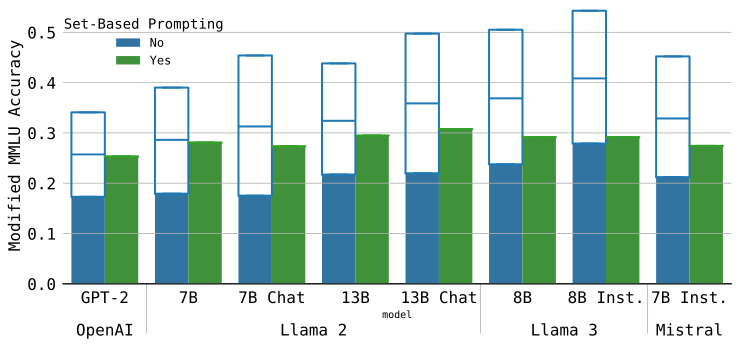

# Set-Based Prompting: Provably Solving the Language Model Order Dependency Problem

## [paper](https://arxiv.org/abs/2406.06581) / [code](https://github.com/reidmcy/set-based-prompting)

This repo contains the code used to generate the results in the paper, the paper is under review, this is the code for the preprint version of the paper and will be updated with the final version of the paper once it is published.


<p align="center">
  <a href="images/png/mmlu_all_err_plot.png"></a>
</p>

# Abstract

The development of generative language models that can create long and coherent textual outputs via autoregression has lead to a proliferation of uses and a corresponding sweep of analyses as researches work to determine the limitations of this new paradigm. Unlike humans, these 'Large Language Models' (LLMs) are highly sensitive to small changes in their inputs, leading to unwanted inconsistency in their behavior. One problematic inconsistency when LLMs are used to answer multiple-choice questions or analyze multiple inputs is order dependency: the output of an LLM can (and often does) change significantly when sub-sequences are swapped, despite both orderings being semantically identical. In this paper we present Set-Based Prompting, a technique that guarantees the output of an LLM will not have order dependence on a specified set of sub-sequences. We show that this method provably eliminates order dependency, and that it can be applied to any transformer-based LLM to enable text generation that is unaffected by re-orderings. Delving into the implications of our method, we show that, despite our inputs being out of distribution, the impact on expected accuracy is small, where the expectation is over the order of uniformly chosen shuffling of the candidate responses, and usually significantly less in practice. Thus, Set-Based Prompting can be used as a 'dropped-in' method on fully trained models. Finally, we discuss how our method's success suggests that other strong guarantees can be obtained on LLM performance via modifying the input representations.


# Setup

## Install Package

Clone the repository and install the package using the following command:

```
pip install . # install the package in editable mode since it is still under development
```

This should install the package `set_based_prompting` and its dependencies.

## Run Tests

`/data` contains sample input and output files for testing the code. The current versions to target are `sample_script_input_new.json` and `sample_script_output_new.json`.

To run the tests, use the following command:

```
python main.py --infile data/sample_script_input_new.json --outfile test.json
```

This will generate a file `test.json` with the output of the model. The output should match the `sample_script_output_new.json` file exactly.

# Usage

The main usage is via `main.py`. The script takes in an input json file and generates an output line json file with one line per prompt. The input json file should have the following format, note that delimiters are required to denote which substrings of the input prompt are processed in parallel:

```
{
    {
            "prompt": "A <|start_2d|>B<|split_2d|>C<|split_2d|>D<|end_2d|>E"
    },
    {
            "prompt": "F <|start_2d|>G<|split_2d|>H<|split_2d|>I<|end_2d|>J"
    }
}
```

`<|start_2d|>` indicates the start of a parallel processing block, `<|split_2d|>` indicates the split between parallel processing blocks, and `<|end_2d|>` indicates the end of a parallel processing block. The script only does a basic check to make sure the delimiters are present and in the correct order, but does not check for any other errors.

The output json file will look something like this:

```
{
  "prompt": "What animal makes the best friendly, outgoing pet? Options: <|start_2d|>dog<|split_2d|>cat <|split_2d|>hamster<|end_2d|>. Answer: ",
  "output_order_dependent": {
    "prompt": "What animal makes the best friendly, outgoing pet? Options: <|start_2d|>dog<|split_2d|>cat <|split_2d|>hamster<|end_2d|>. Answer: ",
    "model": "GPT2LMHeadModel",
    "max_new_tokens": 10,
    "order_independent_output": false,
    "pad_attention": false,
    "text_output": "dogcat is a great pet for your dog."
  },
  "output_order_dependent_rev": {
    "prompt": "What animal makes the best friendly, outgoing pet? Options: <|start_2d|>hamster<|split_2d|>cat <|split_2d|>dog<|end_2d|>. Answer: ",
    "model": "GPT2LMHeadModel",
    "max_new_tokens": 10,
    "order_independent_output": false,
    "pad_attention": false,
    "text_output": " \"I think it's a cat. I"
  },
  "output_order_independent": {
    "prompt": "What animal makes the best friendly, outgoing pet? Options: <|start_2d|>dog<|split_2d|>cat <|split_2d|>hamster<|end_2d|>. Answer: ",
    "model": "GPT2LMHeadModel",
    "max_new_tokens": 10,
    "order_independent_output": true,
    "pad_attention": false,
    "text_output": "cat................................................................................................................................................................................................................................................................................................................................................................................................................................................................................................................................"
  }
}
```

This is for the three different outputs: the output of the model with the original order, the output of the model with the order of the parallel substrings reversed, and the output of the model with the parallel substrings processed in parallel.
